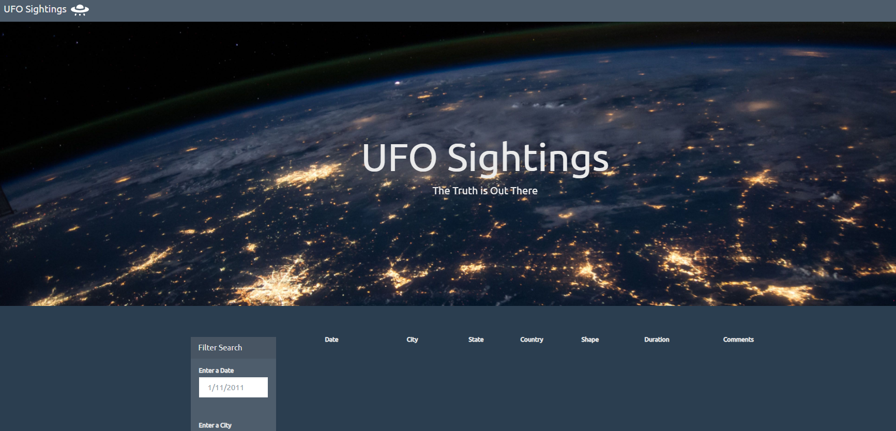
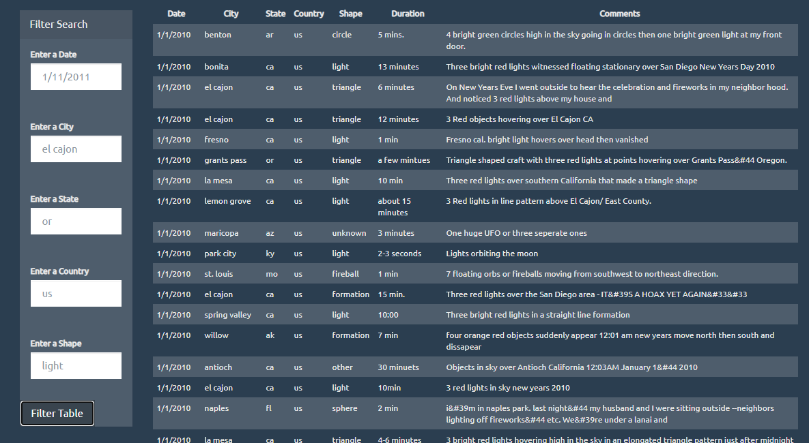
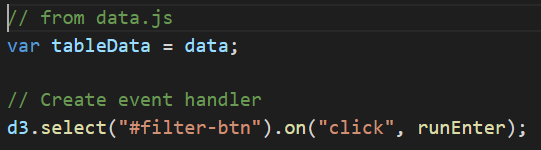
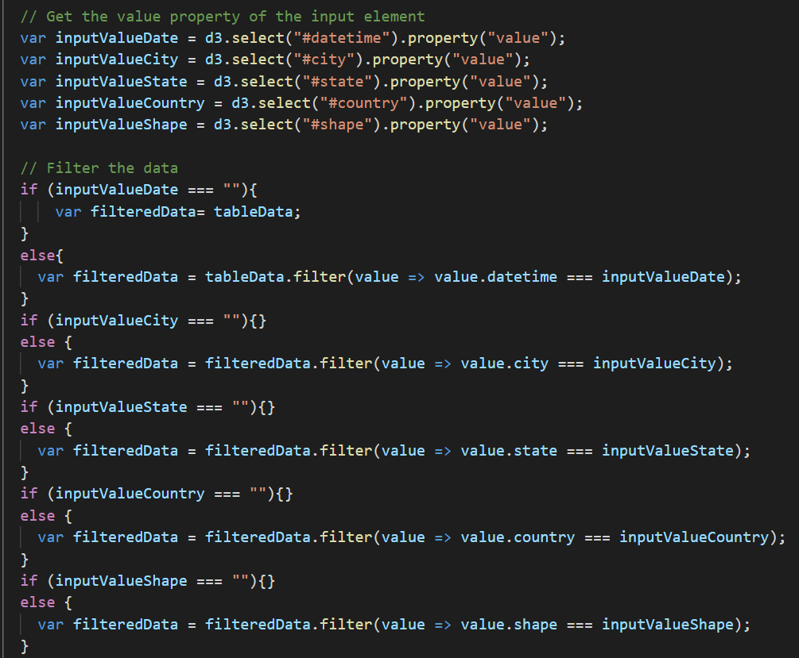
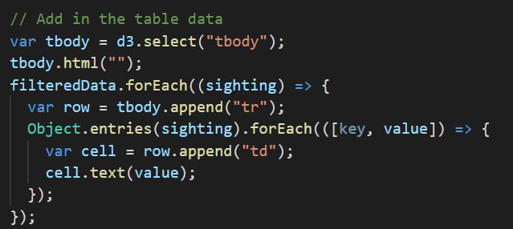

[View my GitHub Portfolio](https://joekell.github.io/)

# JavaScript DOM Challenge - Provide Proof of Aliens

## Summary

In this project, I built a website to display information about alien sightings with filter capabilites so that the user only sees what they want. The final application is hosted on Github Pages at <https://joekell.github.io/DOM_Manpulation_ALIEN-PROOF/>.

### Using the Final Application
The application can be reached at <https://joekell.github.io/D3InteractiveScatterPlot/> and is hosted on Github Pages. When opening the page no data shows at first.

After scrolling down, you can click "Filter Table" without entering any of the filters to view all data.

To view sightings from a particular date, city, state, county, or shape, enter the desired results in the appropriate fields and then click "Filter Table"!

## Tools
These are the tools, techniques, and resources used in this project.

* Javascript is used to filter to the appropriate data upon click of the filter button

* HTML is used for the framework of the page

* Github Pages is used to host the data and final application

### About the Data

Alien sighting data was provided for the challenge without a source, it was likely generated.

## Project Steps

### Step 1: Filter Button
After loading the data in from the data.js file, the only step of this code is to call the event handler function. The function then does all of the work.

### Step 2: Filter the Data

The first step in the function is to determine if the user wants any filters applied by assigning those inputs to variables.

Then, through a series of if statements that check if a variable is empty, the data is filtered to only include values that were specified.

### Step 3: Create the Table

The table is built using a forEach statement on the filtered data.

